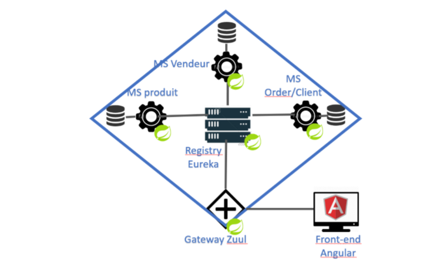
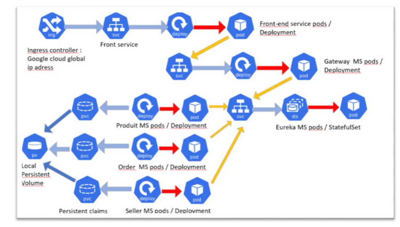
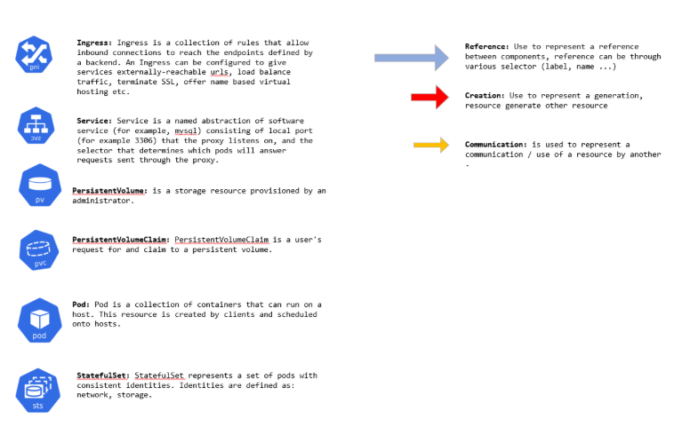

# ProjetWebDist
Projet Web / distribué, application web en architecture micro service déployé sur kubernetes

Le projet contient 6 dossier chacun représentant un service de l'application:
- Eurekaserver : serveur eureka
- Zuulserver : gateway
- produits/sellers/ordersMicroService : micro service backend de l'application (eureka clients)
-  inventoryfrt: Front end angular de l'appliccation

# Instruction pour lancement sur VM / Cloud : 
 
Pour le lancement sur vm, il suffit de lancer : 
 
kubectl apply -f deploiment-miniventaire.yaml 
 
il faut ensuite vérifier si une adresse ip a été attribué au contrôleur ingress avec : 
kubectl get  ingress 
si c’est le cas, ajouter l’ip au ficher /etc/hosts avec les adresse : « frontend.localhost » et « backend.localhost », le suite web sera accessible via « frontend.localhost ». 
 
Pour un lancement sur google cloud, il faut d’abord créer une adresse ip global grace à la commande :  
      gcloud compute addresses create myglobalingress-ip –global 
 
Ensuite utiliser le fichier yaml deploiment-miniventaire-cloud.yaml, le site web sera accessible via l’adresse IP attribué (get ingress).

# Architecture de l'application web : 

# Architecture kubernetes cloud :
 

# Petit Obstacle : 
 
La configuration du Controller ingress « gce », qui permet de posséder une adresse IP global, ne me permet malheureusement pas de rediriger toutes mes routes front end vers angular tel que je le souhaite, ainsi le site web est accessible sur le lien root « / », à partir de la on peut naviguer sur l’ensemble de l’application, cependant tout autre chemin n’est pas accessible depuis l’url du navigateur car elle ne se fait pas router correctement par Ingress. 

Voici un lien vers une issue liée à ce sujet, une solution a été proposé mais qui prendrait plus de temps à mettre en place. 
Cependant cette erreur n’apparait pas lors d’un déploiement sur VM avec un contrôleur ingress Traeffik.
